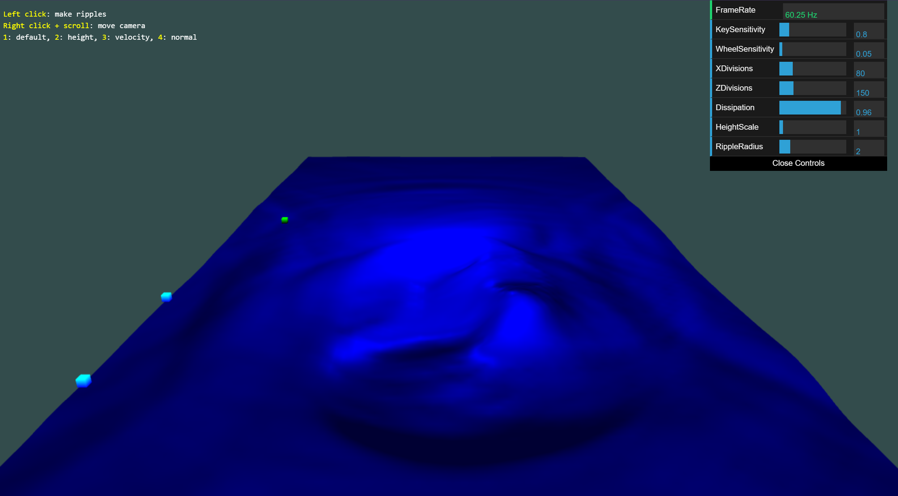

# ripple

A simple webgl simulation of the surface of a fluid. I was inspired to make this after seeing this [really cool simulation](https://threejs.org/examples/webgl_gpgpu_water.html) as part of three.js's examples. The algorithm for evolving the height of the surface in that example turned out to be based on [this really old article from 1998](https://web.archive.org/web/20080618181901/http://freespace.virgin.net/hugo.elias/graphics/x_water.htm). The trail ends there, but even that one's author attributes it to someone else. It's a really simple algorithm but it produces a pretty realistic effect.

Other than the height map, the simulation also calculates a velocity field for moving the little cubes and a normal map for lighting. The velocity field is simply the gradient of the height map multiplied by -1. 

My implementation is written with plain webgl. The lighting isn't as nice as what three.js offers; I basically followed along with the [Basic Lighting chapter](https://learnopengl.com/Lighting/Basic-Lighting) from learnopengl.com. Nevertheless it still creates a pretty cool simulation. 

Hosted on [github.io](https://bassicali.github.io/ripple/).

## Credits
- [Three.js Water Example](https://threejs.org/examples/webgl_gpgpu_water.html)
- [dat.gui](https://github.com/dataarts/dat.gui)